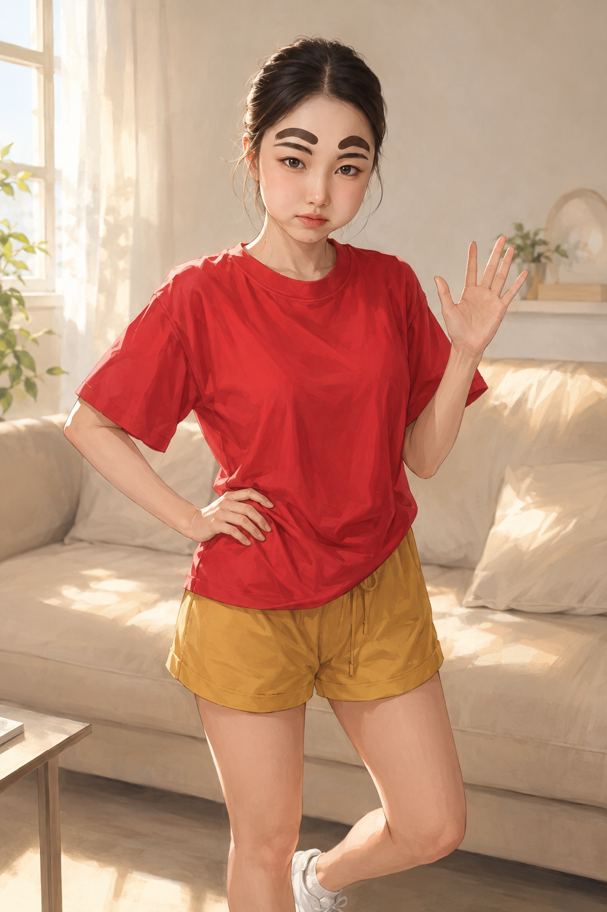
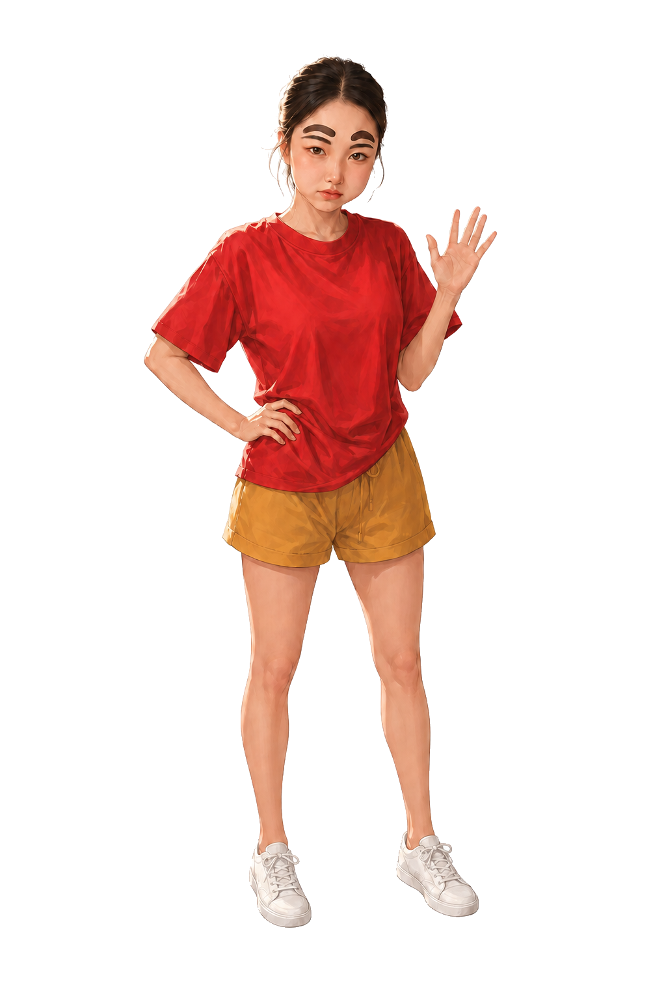

# 하이희야 아바타 시안

MA **짱구 희야** 카드의 얼굴·헤어·눈썹 분장·표정과 붉은 티셔츠를 기준으로 제작한 별도 아바타 시안이다. 용병 로스터에 추가하는 작업이 아니다.

## 로비 일러스트

1024×1536 RGB PNG. 네이티브 생성 원본을 무가공 복사했고 사용자 작화 검수 대기다.

## 장비창 전신 — 실제 투명 PNG

1024×1536 RGBA PNG. 이미지 생성 도구의 두 차례 알파 실패 후, 사용자의 **배경만 코드로 제거** 승인으로 실제 투명 전신을 만들었다. 원본 캔버스·얼굴·의상·포즈는 유지했고 불투명 픽셀의 RGB 변경은 0이다. 흰 운동화와 손을 보존하고 팔 안쪽·손가락·다리·잔머리 주변까지 검수했다.

[어두운 배경 검수](assets/qa-equipment-dark-v1.png) · [밝은 배경 검수](assets/qa-equipment-light-v1.png)

로비용 1024/640px WebP와 장비창용 640px WebP도 별도 파생 리소스로 준비했다. 체크무늬가 그려진 `equipment-draft-v2.png`는 제작 기록용이며 운영 리소스로 쓰지 않는다.

2026-09-08 CMS 누락 수정: `A-13 / HI_HEEYA / 하이희야`를 운영 아바타 카탈로그에 등록한다. 로비 1024/640px와 장비 640px WebP는 위 파생 리소스에 연결되며, `/api/admin/avatars` 초기화에서 중복 없이 등록된다. 재실행해도 기존 CMS 편집값을 덮어쓰지 않는다.

하이희야의 데이터 사용·유저 공개·상점 판매는 모두 OFF, 획득 방식·효과·가격은 미설정이다. 전체 아바타 시스템 설정, 기존 12종 설정, 소유권과 지급 내역은 변경하지 않는다. 사용자가 CMS에서 작화와 운영 설정을 확인한 뒤 공개할 수 있다. 검수 결과와 해시는 [manifest.json](manifest.json), 사용한 전체 생성 프롬프트는 [prompt.md](prompt.md)에 기록했다.

검증: `node --test preview/avatar-hi-heeya-v1/qa-assets.test.cjs`
