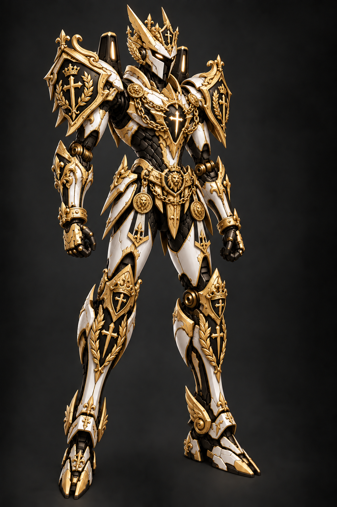

# Z바디 후보군

등록일: 2026-09-16 (Asia/Seoul)

## Z바디 후보1

사용자 지시: **“좋아 후보군 Z바디 후보1로 등록해놔”**

- **콘셉트:** 흑백 성기사 메카에 골드 장갑, 왕관, 견갑 문장, 가슴 금사슬, 허리 인장, 팔다리 금장 부조를 더한 상위 기체.
- **구도 고정:** 오른쪽을 보는 3/4 전신, 길고 날씬한 체형, 팔을 내린 자세와 기존 발 위치.
- **등록 범위:** 후보군 보관. 최종 외형 선정·게임 장비 등록·운영 연결은 별도다.
- **원본:** 1024×1536 RGB PNG, 배경 포함. 생성 결과를 재압축·리사이즈·배경 제거 없이 그대로 복사했다.
- **파일:** [후보1 원본](assets/z-body-candidate-01-gold-paladin.png)
- **원본 SHA-256:** `246F6BB487D114B208D8CFB77E4F0D3F8F9422A17C395FBFE08F415549B30756`

## 관리 기준

- 단일 후보 목록은 [manifest.json](manifest.json)이다.
- 후보1은 마지막 금장 장식 추가본이다. 이전 흑백본·골드 채색본과 혼동하지 않는다.
- 후보1의 원본 파일과 해시를 보존하며, 후속 수정은 별도 버전으로 저장한다.
- 전투 투명 PNG·사격 아틀라스는 아직 제작하지 않았다. 이 배경 포함 원화를 전투 스프라이트로 연결하지 않는다.
- 제작 도구는 기본 내장 `image_gen`이며, 최종 생성 프롬프트는 [PROMPTS.md](PROMPTS.md)에 보관한다.
- 실사용 리소스를 제작할 때는 [배틀슈트 기준](../../docs/project-v-account-battle-suit-standard.md)과 승인된 원본 무기 합성 규칙을 따른다.
