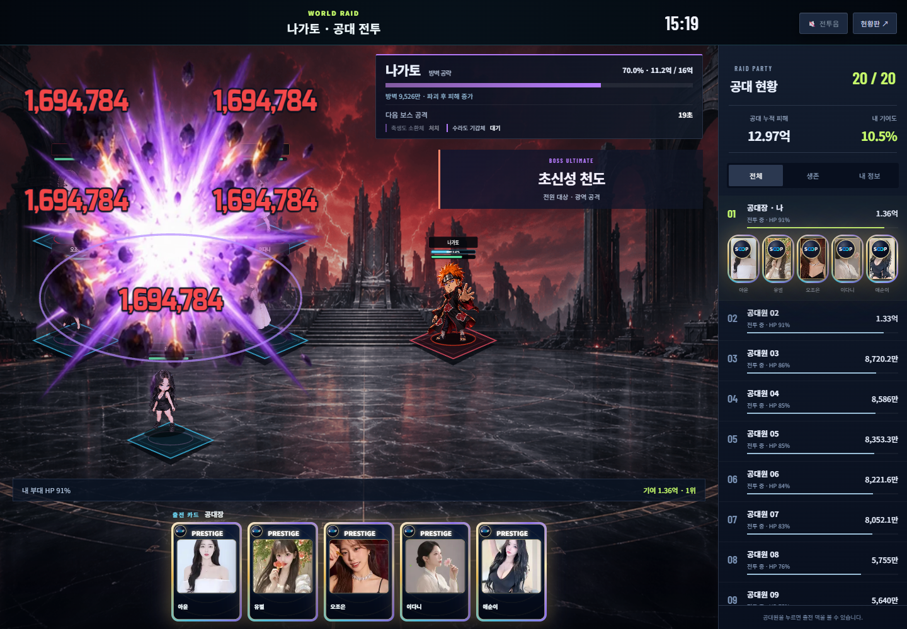
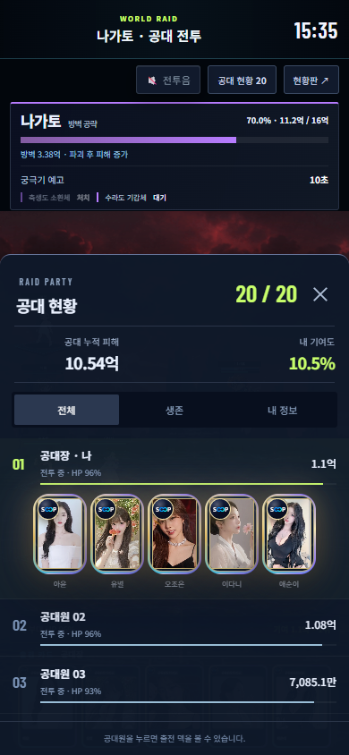

# 월드레이드 실제 V3 전장 검수 — 2026-10-08

실제 메인 로더와 PROJECT V V3를 실행한 검수다. 참가자 20명과 API 응답은 루프백 로컬 데이터이며 운영 계정·입장권·재화에 쓰지 않았다.

- PC: 1440×1000. V3 진형과 원본 카드 도크, 공대 현황, 카드 펼치기, 생존/내 정보 필터.
- 모바일: 390×844. V3 전장과 원본 도크, 공대 현황 하단창, 전원 대상 궁극기.
- 3종 궁극기 12프레임 및 7번 충돌 프레임, 실제 EffectLayer, 캔버스 1개, 같은 발동 중복 억제, 원본 HP 동기화와 잔여 효과 0 확인.
- 궁극기 중 닫기, 동작 줄이기, 백그라운드 복귀, 화면 이동, 서버 종료 후 기존 결과/단일 청구 경로 검수.
- 보스 피해 숫자에 공격 카드의 ARMOR BREAK 문구가 상속되지 않으며 공유 TextStyle을 변경하지 않는다.
- 데스크톱 보스 HUD를 우측으로 배치해 아군·피해 숫자를 가리지 않도록 최종 재촬영했다.

결과는 browser-review.json, 자산 원본 해시와 타이밍은 manifest.json에 있다. 촬영 자료는 캐릭터 원화/SD를 새로 승인하는 기록이 아니다.

재현: node scripts/serve-world-raid-v2.mjs 실행 후 PLAYWRIGHT_MODULE을 설치된 Playwright 모듈로 지정하고 node scripts/qa-world-raid-combat-v2.mjs를 실행한다.

